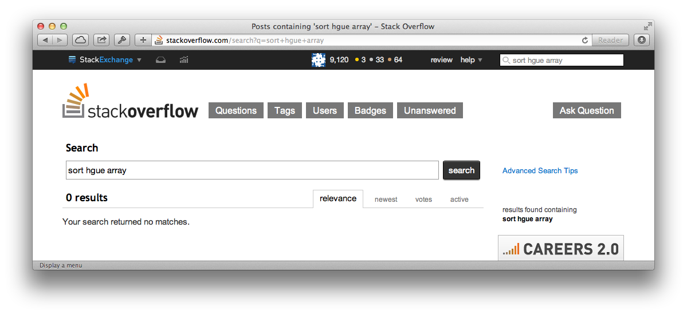
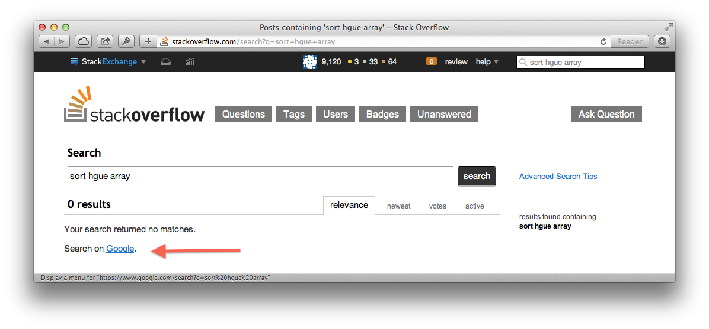
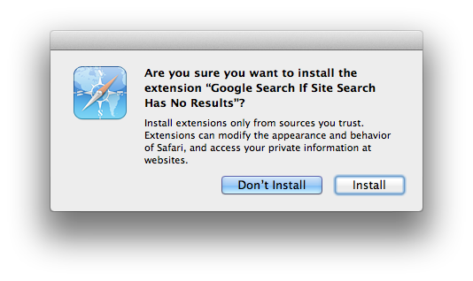
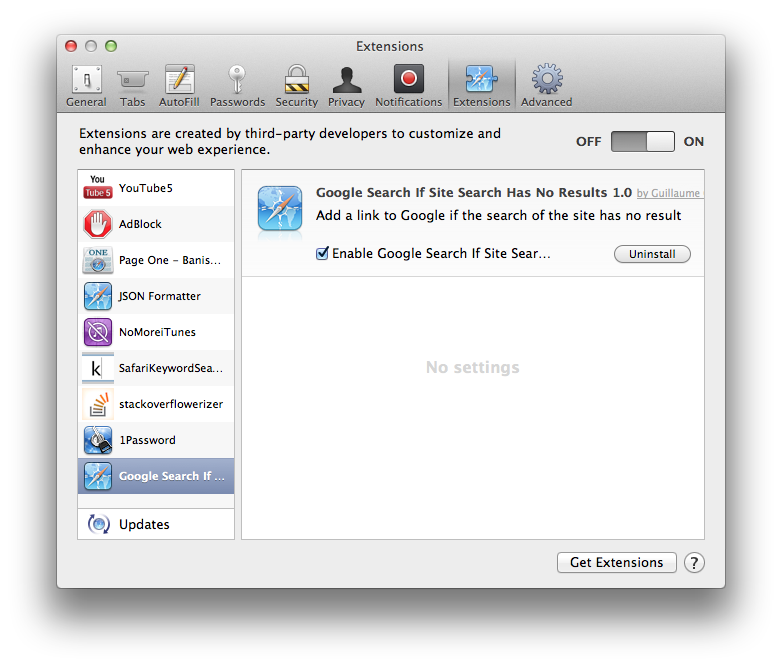
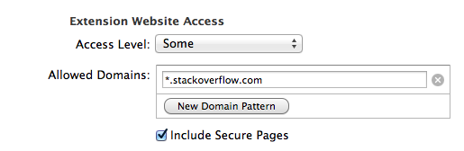
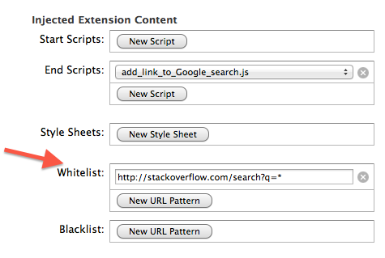

# Safari Extension: Google Search If Site Search Has No Results

## What is it?
**This Safari extension detects when a website search returns no results. It then adds a link to Google for the same search query.**

This is helpful, because when you are not using the perfect keywords, Google is way better at selecting what you are searching than any search engine of a website.  
Sometimes, only mixing up two letters prevents any search results to show up.

Without the extension, the search `sort hgue array` on Stackoverflow.com will only display the not very helpful: `Your search returned no matches.`:

  

With the extension, a link to Google will be added: 

  

The Google search is configured with the same keywords used on the local search, and is limited to the original site domain (using the filter `site:domain.com`).

## Currently supported website(s)
- Stackoverflow.com

## How to install

- Download the extension from (no download link yet). 
- Double-click on the Google Search If Site Search Has No Results.safariextension
- Safari will ask you to confirm the installation:  
  
- The extension will now appear in the extension installed list (tab Extensions in Safari's Preferences):
  

## Current version and Release Notes

Current version: 1.0

## How to update

See section 'How to install'.
TODO: Implement the update manifest file for automatic updates.

## Uninstall

If you want to uninstall it, just click the uninstall button in the extension description in tab Extensions in Safari's Preferences.

## How to add support for an other website

- Fork this project

- Add the domain of your website to the 'Allowed Domains' list.  
For example: `*.stackoverflow.com`  
  
This tell Safari to load this extension when visiting the host name.
    
- Add a New URL Pattern to the Whitelist to whitelist the search pages.  
For example: `http://stackoverflow.com/search?q=*`  
  
This tell Safari to only load this extension when visiting a search page  
*Note that as per the documentation, the wildcard * can not be used in the scheme.*  
**BUG: As per my testing, the whitelist does not work as expected. Ie, only having this in the whitelist: `http://stackoverflow.com/search?q=*`, the extension is still loaded on `stackoverflow.com` or `http://stackoverflow.com/tags`.**

- Implement the 3 functions to search and manipulate the DOM tree:  
  detect if user is visiting a search result page with no results found: `is_a_search_page_with_no_results_DOMAIN()`,  
  get the keywords of the search query: `text_of_search_query_DOMAIN()`,  
  get the insertion place for the new node: `node_where_to_append_new_node_as_a_child_DOMAIN()`

- Test it.  
To reload the extension, use Extension Builder (via Safari's Menu Bar: Develop > Show Extension Builder).
If you don't have a Safari Developer Certificate, get one or test by copying and pasting your js code in the console

- Add yourself to the contributors section. 

- Send a pull request.

Thank you!

## Authors

Guillaume Cerquant, founder of [Courrier-App](http://www.courrier-app.fr "Envoi de recommandés par internet") and [MacMation](http://www.macmation.com "Mac Automation"). Twitter account: [@gcerquant](http://www.twitter.com/gcerquant "Guillaume Cerquant's twitter account").

## Contributors

- Would love to see your name added here :)